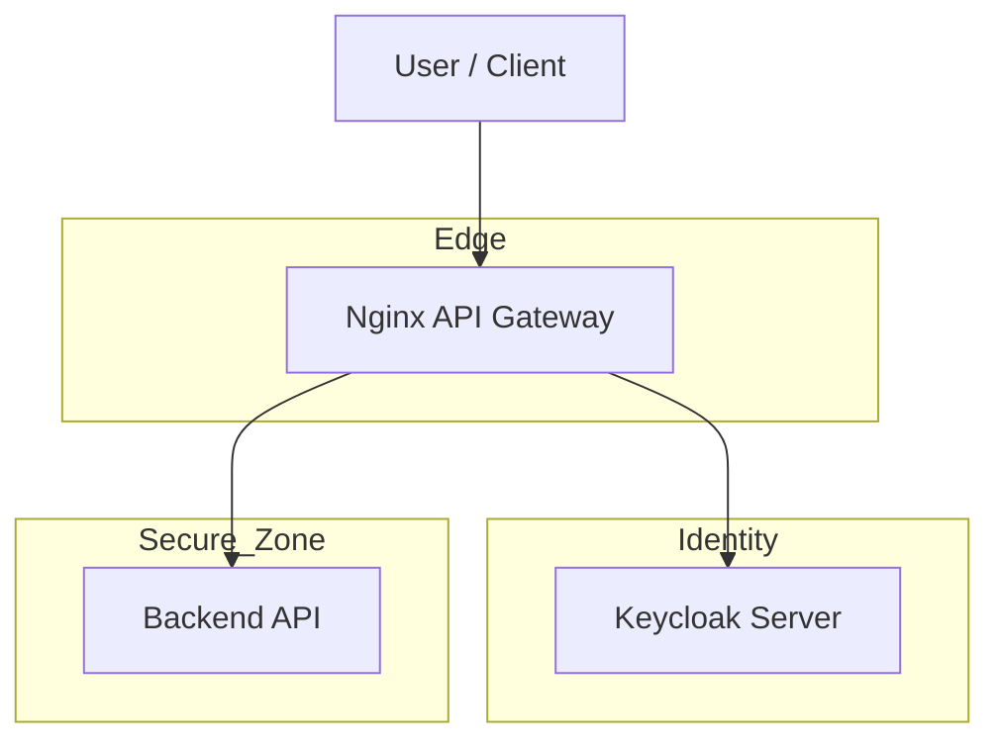

# PROJECT REPORT: ZERO TRUST ARCHITECTURE FOR ENTERPRISE SECURITY

**Project Title:** Implementing Zero Trust Architecture (ZTA) for Enhanced Enterprise Security  
**Project Category:** Minor Project 2  
**Author:** Aditya Sonune

---

## ABSTRACT

The traditional "Perimeter-Based" security model is proving inadequate in the face of modern cyber threats and remote workforces. This project investigates and implements a Zero Trust Architecture (ZTA) to address vulnerabilities inherent in legacy networks. By shifting the focus from "network location" to "identity verification," I have developed a multi-layered simulation environment using Docker, Nginx, and Keycloak. This report details the implementation of micro-segmentation, policy-based routing, and mandatory multi-factor authentication (MFA). The results demonstrate that ZTA effectively prevents lateral movement by attackers and ensures that sensitive backend resources remain protected even during a simulated breach.

---

## 1. INTRODUCTION

Cybersecurity has evolved from a technical "add-on" to a fundamental pillar of business continuity. In the past, companies secured data by building a "perimeter"—a strong wall around the office network. However, with employees working from home and services moving to the cloud, these walls has disappeared.

Zero Trust Architecture (ZTA) solves this by assuming the network is already breached. It follows a "Never Trust, Always Verify" principle, requiring every request to be authenticated and authorized regardless of where it originates.

## 2. PROJECT SUMMARY & OBJECTIVES

My goal for this project was to build a working simulation of a Zero Trust environment to see how it handles security differently than a traditional network.

### Core Objectives

1. **Identity-First Access:** Ensure all requests go through an identity provider.
2. **Network Segmentation:** Isolate backend services so they aren't reachable via the public internet.
3. **Strict Policy Enforcement:** Use a gateway to intercept and validate every single connection attempt.

## 3. ARCHITECTURE DESIGN

The core of the implementation is divided into three distinct zones. This ensures that a compromise in the "Edge" zone does not lead to a breach in the "Secure Zone."



### Gateway Routing Rules

| Request Path | Target Service | Security Enforcement |
| :--- | :--- | :--- |
| `/api/*` | `zta-secure-api` | Token validation required before forwarding. |
| `/auth/*` | `keycloak` | Direct path for SSO and MFA authentication. |
| `/*` | **Blocked** | Returns 403 Forbidden to prevent reconnaissance. |

---

## 4. IMPLEMENTATION METHODOLOGY

### 4.1 Network Segmentation

I used Docker bridge networks to isolate the backend components. The API is hidden on a private network (`backend-net`) and can only be reached through the Nginx gateway. This eliminates direct external access to sensitive data.

### 4.2 Identity and Access Control

Keycloak serves as the central identity provider. By enabling Multi-Factor Authentication (MFA), the system ensures that stolen credentials are not enough to gain access. The gateway validates a secure JWT token before allowing traffic to hit the backend.

### 4.3 Access Policies

* **Role-Based Access (RBAC):** Users are assigned "Admin" or "User" roles.
* **MFA Requirement:** Every login attempt triggers a TOTP (One-Time Password) challenge.
* **Default Deny:** The Nginx proxy is configured to block any traffic that doesn't match a specific secure route.

---

## 5. TECHNICAL IMPLEMENTATION

### 5.1 Service Orchestration (`docker-compose.yml`)

The setup uses containerization to mimic a complex enterprise network on a single host.

```yaml
services:
  keycloak:
    image: quay.io/keycloak/keycloak:latest
    networks: [iam-net]
  api-gateway:
    image: nginx:alpine
    networks: [public-net, backend-net, iam-net]
  backend-api:
    image: hashicorp/http-echo
    networks: [backend-net]
```

### 5.2 Gateway Enforcement (`nginx.conf`)

The Nginx configuration acts as the **Policy Enforcement Point**. It bridges the public network and the private backend, ensuring no unauthenticated traffic passes through.

## 6. FINDINGS & TESTING

After running the simulation, I observed the follow resilient behaviors:

* **Bypass Prevention:** Attempting to reach the API directly failed because it lacks a public port mapping.
* **MFA Effectiveness:** Simulated credential theft was successfully blocked at the login stage by the TOTP requirement.
* **Lateral Movement Blocking:** Even if an attacker gained access to the Gateway container, they could not easily pivot to the Identity provider due to network segregation.

---

## 7. OBSERVATIONS FROM THE PROJECT

| Point | Key Observation |
| :--- | :--- |
| **Location Neutrality** | Trust is no longer tied to being "in the office." |
| **Identity Dominance** | Strengthening the login process is the highest ROI security fix. |
| **Simplicity** | Centralizing rules at the gateway makes security easier to audit. |
| **Automation** | Using Docker allows for "Security-as-Code" deployments. |

## 8. CONCLUSION

This project demonstrates that Zero Trust is a highly effective way to handle modern security challenges. By moving away from the old perimeter model and focusing on identity and network isolation, we can build systems that are much harder for attackers to compromise. Future work will involve implementing "Continuous Verification," where the system monitors user behavior even after a successful login.


